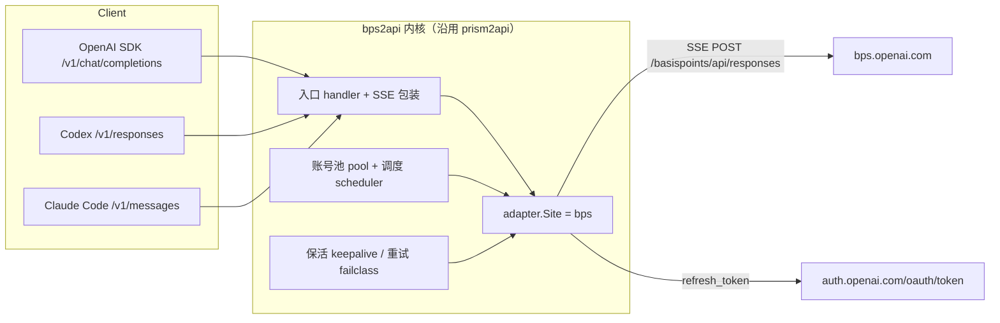
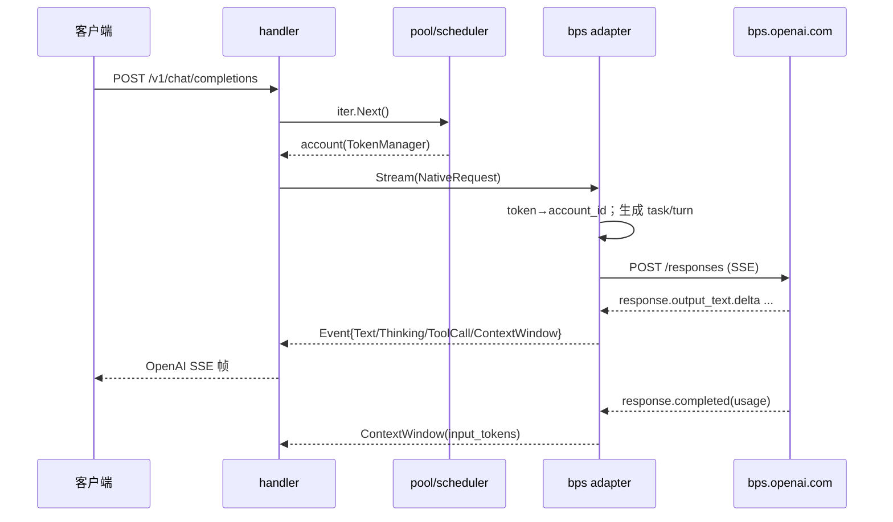

# DESIGN — bps 适配

## 1. 整体架构



- 内核不再关心上游是 start/轮询还是 SSE：适配器把上游事件映射成 `adapter.Event`，内核生成各协议帧。
- 账号 = ChatGPT 凭据（access_token + refresh_token），`chatgpt-account-id` 从 access_token JWT 推导。

## 2. 适配器模块设计

```
internal/adapter/bps/
├── site.go          Site 实现（New/Name/NewClient/NewCatalog/Auth/MapChat）
├── endpoints.go     路径常量（/responses、/responses/compact、auth 端点）
├── credentials.go   凭据解析/编码（auth JSON、裸 JWT、rt. token、JWT claims 提取 account_id/email）
├── refresh.go       ChatGPT OAuth 刷新（auth.openai.com/oauth/token，form）
├── auth.go          LoginURL/PollLogin/ExchangeCredential
├── models.go        静态模型目录 + 默认模型 + effort 映射
├── map.go           ChatRequest → NativeRequest（生成 task_id/turn_id，模型/档位解析）
├── client.go        httpClient：Stream（POST + SSE）、ListModels、FetchUsage、Set*
├── stream.go        Responses SSE → adapter.Event
└── mock.go          mock 客户端（-mock / 单测）
```

## 3. 接口契约

### 3.1 出站请求

```http
POST {base}/responses
authorization: Bearer <access_token>
chatgpt-account-id: <account_id>
x-openai-account-id: <account_id>
x-basispoints-auth-mode: chatgpt
content-type: application/json
accept: text/event-stream

{"model":"gpt-5.6-sol","input":[...],"stream":true,"store":false,
 "metadata":{"task_id":"<uuid>","turn_id":"<uuid>"},
 "reasoning":{"effort":"high"},
 "tools":[{"type":"function","name":"...","description":"...","parameters":{...}}]}
```

### 3.2 入站事件映射

| 上游 SSE | adapter.Event |
|---|---|
| `response.output_text.delta` | `Text` |
| `response.reasoning_summary_text.delta` / `response.reasoning_text.delta` | `Thinking{Text}` |
| `response.output_item.done`（item.type=function_call） | `ToolCall{ToolCallID,Name,RawArgs}` |
| `response.completed` | `ContextWindow{TokensUsed: usage.input_tokens, TokenLimit}` |
| `response.failed` / `error` | 返回 error（带状态码） |
| HTTP 非 200 | `upstreamError{status,msg}`（failclass 分类换号） |

### 3.3 凭据契约

- 导入 JSON（工程内 `AccountImport`）：`access_token`、`refresh_token`、`email`、`proxy_url`。
- 池内存储：`auth.Token{AccessToken: <JWT>, RefreshToken: <bundle JSON 或 rt.>}`
- 刷新：`ExchangeCredential(secret)` → 解析出 `rt.` → OAuth 刷新 → `Token{AccessToken: new, RefreshToken: bundle(new)}`。
- `chatgpt_account_id` 优先取 JWT claim `https://api.openai.com/auth`.chatgpt_account_id。

## 4. 内核改造点

| 文件 | 改造 |
|---|---|
| `cmd/server/main.go` | import 由 prism 换 bps |
| `internal/api/account_import.go` | CSV 分支改为 bps 凭证列（email/access_token/refresh_token/proxy） |
| `internal/api/machine_import.go` | 改收 token 推送，去掉自动登录 |
| `internal/api/admin_tasks.go` | 删除 sidecar 登录动作与辅助函数 |
| `internal/api/pool_api.go` | 凭据展示改为邮箱/账号 ID/到期 |
| `internal/api/admin.go` / `server.go` | 无 token 分支不再发起浏览器登录 |
| `internal/pool/pool.go` | `StartBrowserLogin` 返回“不支持” |
| `internal/admin/config.go` / `api/prompt.go` | 注入默认关闭，env 前缀改 `BPS_` |
| 品牌字符串 | `prism:` → `bps:`、默认域名/目录名 |
| 删除 | `internal/adapter/prism/`、`cmd/login/`、`sidecar/`、`Dockerfile.login` |

## 5. 数据流



## 6. 异常处理策略

- 401/403 → `upstreamError{status:401}` → 内核按 failclass 摘号/换号。
- 429/5xx → `upstreamError`，内核冷却 + 换号；适配器内对网络错误最多重试 1 次。
- 响应含 `response.failed` → 取 `response.error.message/code`；无状态码默认 500（走换号）。
- SSE 解析失败（半包/非法 JSON）→ 忽略坏帧，不中断流；流无任何输出且未收到 completed → 按 server 错误返回。
- 客户端断开（ctx.Done）→ 返回 `ctx.Err()`，内核识别 Canceled 不换号。

## 7. 与现有系统集成约束

- 适配器只实现流式，非流式由内核 `nonStreamChat` 聚合（沿用 prism2api 机制）。
- 工具调用：每个 function_call 只发一个完整 `ToolCall` 事件，避免 OpenAI 非流式重复。
- 模型目录静态（上游无 `/models`），仅做名称/别名解析；`model` 原样发给上游但上游固定为 `gpt-5.6-sol`，目录以响应中的实际模型为准。
