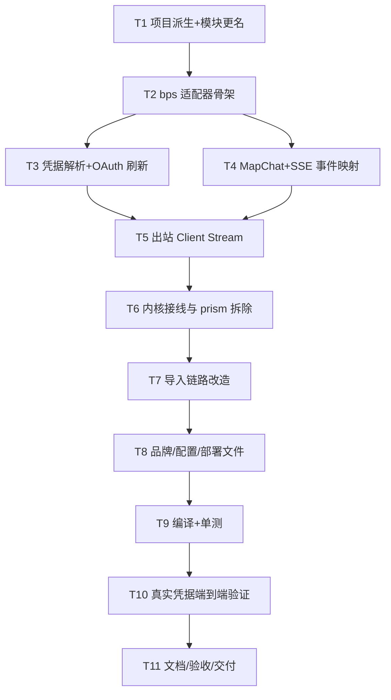

# TASK — bps 适配

## 任务依赖图

## 原子任务

### T1 项目派生 + 模块更名
- 输入：`D:\gore\gotmp\opencode\chatgpt-prism2api`
- 输出：`D:\niubiai.cc\bps2api`，module `bps-2api`，git 初始化。
- 验收：`go build ./...`（改造前基线可编译）。
- 状态：已完成。

### T2 bps 适配器骨架
- 交付：`internal/adapter/bps/site.go`、`endpoints.go`、`models.go`、`mock.go`
- 契约：实现 `adapter.Site` 全部方法；静态目录；默认模型 `gpt-5.6-sol`。
- 验收：`go build ./internal/adapter/bps`。

### T3 凭据解析 + OAuth 刷新
- 交付：`credentials.go`、`refresh.go`、`auth.go`
- 契约：
  - 解析 auth JSON / 裸 JWT / `rt.` / bundle JSON；
  - JWT 提取 `chatgpt_account_id`、`email`、`chatgpt_plan_type`；
  - `ExchangeCredential` 用 rt 刷新（form 表单，client_id 固定）。
- 验收：单测覆盖四种凭据形态与刷新请求体。

### T4 MapChat + SSE 事件映射
- 交付：`map.go`、`stream.go`
- 契约：消息/工具/附件 → Responses input items；生成 task/turn；effort 映射（max→xhigh）；
  SSE → `adapter.Event`（Text/Thinking/ToolCall/ContextWindow/error）。
- 验收：单测喂固定 SSE 文本断言事件序列。

### T5 出站 Client Stream
- 交付：`client.go`
- 契约：POST `/responses`，4 个认证头 + 身份头；非 200 → `upstreamError`（实现 `StatusCode() int`）；
  `ListModels` 返回 ErrNotImplemented；`FetchUsage` 从 JWT 填 email/plan；`SetEgress` 复用 `egress.HTTPClient`。
- 验收：httptest 假上游断言请求头/体 + 事件流。

### T6 内核接线与 prism 拆除
- 交付：`cmd/server/main.go` 换 import；删除 `internal/adapter/prism/`、`cmd/login/`、`sidecar/`；
  4 个耦合文件（account_import/machine_import/admin_tasks/pool_api）改 bps 语义；`StartBrowserLogin` 返回不支持。
- 验收：`go build ./...` 通过。

### T7 导入链路改造
- 交付：CSV 列（email,access_token,refresh_token,proxy）导入；机器导入改 token 推送。
- 验收：单测导入 JSON/CSV 得到 `AccountImport{AccessToken,RefreshToken}`。

### T8 品牌/配置/部署文件
- 交付：`config.go` 默认上游 `https://bps.openai.com/basispoints/api`、加密目录 `.bps-2api`；
  `prism:` 日志前缀清理；`.env.example`/`docker-compose.yml`/`Dockerfile`/workflow 去 sidecar；
  `web` 品牌两处（brand.ts、index.html）。
- 验收：`go build ./...`，`grep -ri prism --include=*.go` 无残留（历史注释除外）。

### T9 编译 + 单测
- 交付：`go build ./...`、`go test ./...` 全绿；修掉引用 prism 的旧测试。
- 验收：命令退出码 0。

### T10 真实凭据端到端验证
- 输入：用户提供的 `access_token` + `refresh_token`（已实测可用）。
- 交付：启动 server，导入账号，调用三类入口各一次，记录响应。
- 验收：
  - `/v1/chat/completions`（流式/非流式）有正文；
  - `/v1/responses` 有 `response.output_text.delta` 与 `response.completed`；
  - `/v1/messages` 有 `text_delta` 与 `message_stop`；
  - `/v1/models` 返回目录。

### T11 文档/验收/交付
- 交付：`ACCEPTANCE_bps适配.md`、`FINAL_bps适配.md`、`TODO_bps适配.md`、README 更新、`项目文件功能说明.md`。

## 依赖与并行

- T3/T4 可并行；T6 依赖 T5；T7 依赖 T6；T9 依赖全部代码任务。
- 风险：上游对 system role / tools / assistant 历史消息的接受度需 T10 实测回填。
